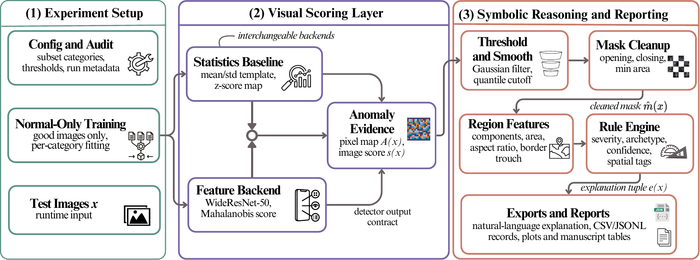

# Rule-Augmented Industrial Anomaly Detection

This repository contains the core implementation for the IECON 2026 submission on rule-augmented explainable anomaly detection for industrial visual inspection.

The project studies how anomaly detection outputs can be converted into structured inspection records rather than left as raw scores and heatmaps. It combines one-class visual anomaly models with a lightweight rule-based reasoning layer that summarizes detected regions through severity, archetype, confidence, and spatial cues. The codebase is organized around a modular pipeline: dataset indexing, model fitting, anomaly-map generation, region cleanup, symbolic interpretation, and report export. The public release focuses on that implementation path and the overall architecture.



This public release keeps only the core implementation and architecture-facing pieces of the project:
- `src/` contains the implementation for configuration, dataset indexing, model fitting, evaluation, region postprocessing, rule-based explanation, and compact reporting.
- `configs/` contains example JSON configs with repository-relative paths.
- `assets/` contains the architecture figure used on the repository landing page.
- `data/` contains dataset instructions only.

This release intentionally excludes manuscript-generation utilities, plotting and visualization code, intermediate outputs, trained model artifacts, and the full MVTec AD dataset.

## Repository Layout

- `main.py`: top-level entry point for fit + evaluate.
- `src/config`: config dataclasses and JSON loading.
- `src/data`: dataset indexing, loading, transforms, and audit utilities.
- `src/models`: statistics baseline and pretrained-feature anomaly models.
- `src/features`: anomaly-map processing and region summarization.
- `src/rules`: symbolic rule engine, priors, and explanation text.
- `src/evaluation`: metrics, records, reports, and consistency utilities.
- `src/pipelines`: fit, evaluate, and dataset-audit entry points.

## Setup

Install the core dependencies:

```bash
pip install -r requirements.txt
```

## Data

The full dataset is not bundled here. Download MVTec AD separately and place it under:

```text
data/mvtec_ad/
```

See [data/README.md](data/README.md) for the expected location and the official source.

## Running

Run the default config:

```bash
python main.py
```

Run a specific config:

```bash
python main.py --config configs/feature_smoke_bottle.json
```

## Notes

- The public configs use repository-relative paths and are safe to edit locally.
- The public release is intentionally narrower than the internal project tree.
- It is meant to expose the implementation outline and system structure, not manuscript-production utilities or intermediate artifacts.

## Contact

Questions can be directed to: `safayat dot b dot hakim at gmail dot com`
